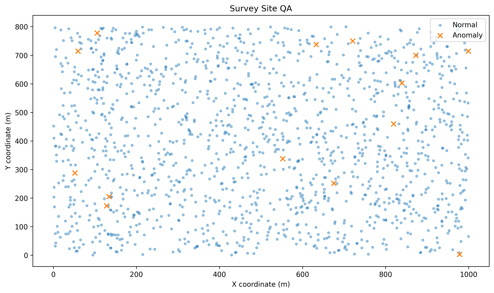
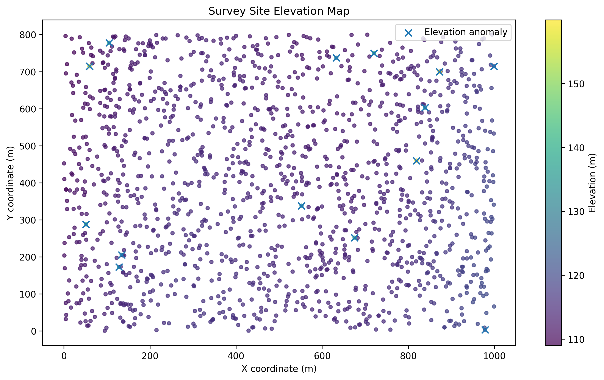
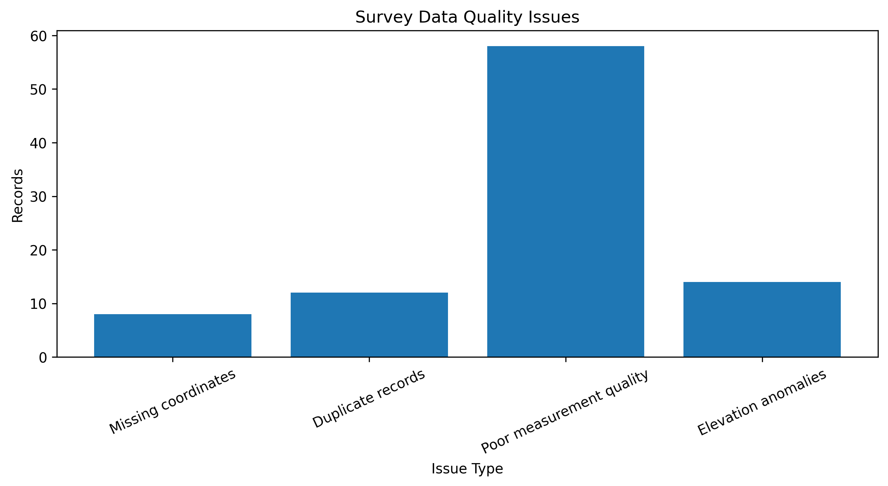

# GeoSurvey QA and Support Triage

## Objective

Check geospatial survey data for common quality problems, identify unusual elevation measurements, and turn the results into something that can be reviewed by both a customer and an engineering team.

The project simulates a survey dataset moving through a production workflow. The goal is to catch bad records early, reproduce reported issues, and provide a clear summary of what needs attention.

## Background

Survey datasets can contain problems that are easy to miss when reviewing thousands of measurements manually. A record may be incomplete, duplicated, marked as poor quality, or contain an elevation that does not agree with nearby measurements.

This project focuses on four checks:

1. **Missing coordinates.** A survey point cannot be used correctly if its spatial position is incomplete.

2. **Duplicate points.** Repeated records can affect downstream analysis and project counts.

3. **Poor quality measurements.** Measurements already marked as poor quality should be separated for review.

4. **Local elevation anomalies.** A point can look valid by itself but still be suspicious when compared with the surrounding terrain.

## Method

1. Generate a synthetic infrastructure survey containing 1,500 points with coordinates, elevation, measurement quality, and collection time.

2. Introduce controlled problems into a copy of the clean dataset so the validation workflow can be tested against known issues.

3. Run basic quality checks for missing coordinates, duplicate records, and poor quality measurements.

4. Find nearby survey points using nearest neighbor analysis and compare each elevation with the local median.

5. Use median absolute deviation to flag measurements with unusually large local elevation differences.

6. Compare detected elevation anomalies against the known injected errors using precision, recall, and F1 score.

7. Visualize the survey site, elevation distribution, and locations of detected problems.

8. Combine the checks into a project health summary showing which records require review.

9. Simulate a customer reported elevation issue, reproduce the problem, collect the affected records, and prepare a support summary.

10. Export the affected records and generate a short customer update with the recommended next step.

## Results

### Survey Site QA

The first view shows the distribution of survey measurements across the project site. Points identified as unusual through the local elevation analysis are highlighted so their spatial locations can be inspected.

### Elevation Analysis

The elevation map shows how measured elevation changes across the survey area. Flagged measurements can be compared directly with the surrounding terrain to understand why they were selected for review.

### Data Quality Issues

The validation workflow also checks for missing coordinates, duplicate records, poor measurement quality, and elevation anomalies. The issue breakdown provides a quick summary of the records requiring attention.

## Validation

The synthetic dataset is created before any errors are introduced, so the locations of the controlled elevation problems are known.

The anomaly detector does not use those locations during detection. It identifies suspicious measurements by comparing each point with its spatial neighbors.

The final predictions are then compared with the known errors using:

Precision

Recall

F1 score

True positives

False positives

False negatives

This makes it possible to evaluate the detection workflow against ground truth instead of relying only on visual inspection.

## Customer Issue Triage

The notebook also simulates a customer reporting unexpected elevation values in a project.

The workflow reproduces the issue, identifies the affected records, summarizes the findings, recommends that the flagged measurements be reviewed before production use, and prepares the records for engineering review.

A customer update and a CSV containing the affected records are generated at the end of the investigation.

## Deliverables

`GeoSurvey_QA_Support_Triage.ipynb`, the complete notebook that runs from top to bottom in Google Colab

`SITE_104_elevation_review.csv`, the records identified during the simulated elevation investigation

`SITE_104_customer_update.txt`, a short customer facing summary of the investigation

`survey_site_qa.png`, spatial view of the survey site and detected anomalies

`elevation_map.png`, elevation distribution across the survey site

`issue_breakdown.png`, summary of detected data quality issues

## Why this is useful

The project connects data validation with technical support instead of stopping at anomaly detection.

A workflow like this can help a technical team catch questionable survey records before production use, reproduce a reported problem, give engineering a focused set of records to investigate, and communicate the result clearly to the customer.

It also provides a repeatable way to test the detection logic because the synthetic failures are known in advance.

## How to run it

Open `GeoSurvey_QA_Support_Triage.ipynb` in Google Colab and run the cells in order from the top.

The dataset is generated inside the notebook, so no external dataset is required.

The final cells produce the QA results, spatial visualizations, project health summary, customer update, and CSV containing the records selected for review.

## Built with

Python, pandas, NumPy, matplotlib, scikit learn, Google Colab, nearest neighbor analysis, and robust statistical analysis.

## Possible next steps

Testing the workflow on public survey or geospatial datasets would be the next step.

The project could also be extended with interactive maps, project usage monitoring, database integration, automated support ticket classification, and additional spatial validation methods.

## Author

**Sourabh Gopinath More**

MS Computer Science [LinkedIn](https://www.linkedin.com/in/sourabhmore73/) | [Portfolio](https://sourabhmore.carrd.co/) | [GitHub](https://github.com/sgm7373)
